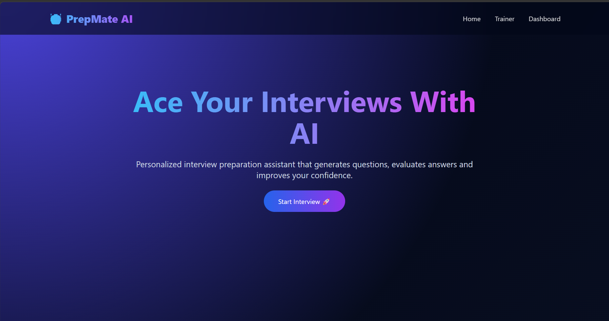
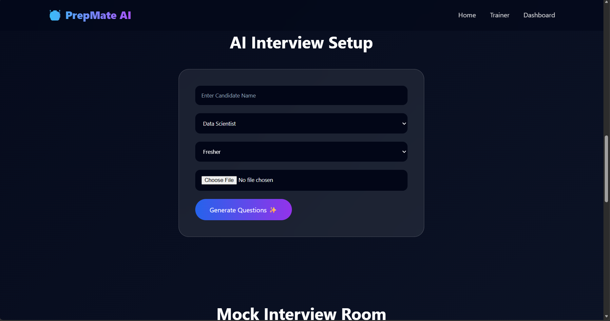
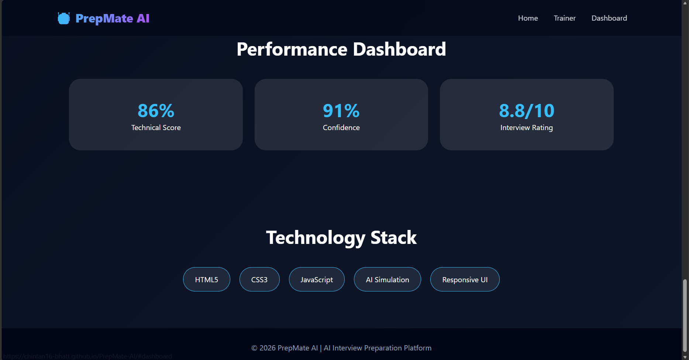

Readme · MD
# 🤖 PrepMate AI
 
**Your Personal AI-Style Interview Coach 🚀**
 
PrepMate AI is a browser-based interview prep tool built to help job seekers sharpen their technical answers, polish their communication, and walk into interviews with more confidence. It mimics an intelligent interview coach — generating role-specific questions, reviewing responses, and offering tips on where to improve.
 
---
 
## 🌟 About the Project
 
No two interviews are the same — a backend role, a design role, and an HR round all call for different prep. PrepMate AI gives candidates a focused practice space: pick a role, set an experience level, and run through a simulated interview session in an interactive interface.
 
---
 
## ✨ Core Features
 
### 👤 Profile Setup
- Add your basic candidate info
- Pick the job role you're targeting
- Set your experience level
- Resume upload section
### 🎯 Tailored Question Sets
- Questions matched to the chosen role
- Technical/coding-focused prompts
- HR & behavioral round prep
- Skill-specific drills
### 🤖 Mock Interview Mode
- Simulated interview room experience
- AI-interviewer-style flow
- Questions generated on the fly
- Space to type and submit answers
### 📊 Response Evaluation
- Automated review of submitted answers
- Scoring for each interview attempt
- Highlights of strong points
- Suggestions for what to work on
### 📈 Progress Dashboard
- Track technical performance over time
- Confidence rating
- Overall interview-readiness score
---
 
## 🛠️ Built With
 
**Frontend**
- HTML5
- CSS3
- JavaScript
**Design Approach**
- Fully responsive layout
- Glassmorphism-style UI
- Gradient-based visuals
- Clean, modern dashboard look
---
 
## 📂 Folder Structure
 
```
PrepMate-AI/
│
├── index.html
├── style.css
├── script.js
├── README.md
└── screenshots/
```
 
---
 
## ⚙️ App Flow
 
```
Set Up Profile
      ↓
Choose Role & Experience Level
      ↓
Generate Questions
      ↓
Run Mock Interview
      ↓
Review Answers
      ↓
Get Feedback & Score
```
 
---
 
## 🚀 Roadmap
 
- [ ] Hook up a real AI/LLM backend
- [ ] Resume parsing
- [ ] Voice-based interview mode
- [ ] User login & authentication
- [ ] Save & revisit past interview attempts
- [ ] Export performance report as PDF
- [ ] Persistent database storage

---
 
## 🎯 Why This Project Exists
 
PrepMate AI was built to give students and job seekers a low-pressure space to rehearse interviews, get honest feedback on their answers, and build real confidence before the actual interview day.


---

## 📸 Screenshots

### Home Page


### Interview Trainer


### Performance Dashboard



---

## 🌐 Live Demo

   https://chintan16-bhatt.github.io/PrepMate-AI/


---

## 🔗 Repository


https://chintan16-bhatt.github.io/HireWise-AI/


---

## 👨‍💻 Developer


**Chintan bhatt**


---

## ⭐ Support


If you find this project useful, consider giving it a ⭐ on GitHub.

